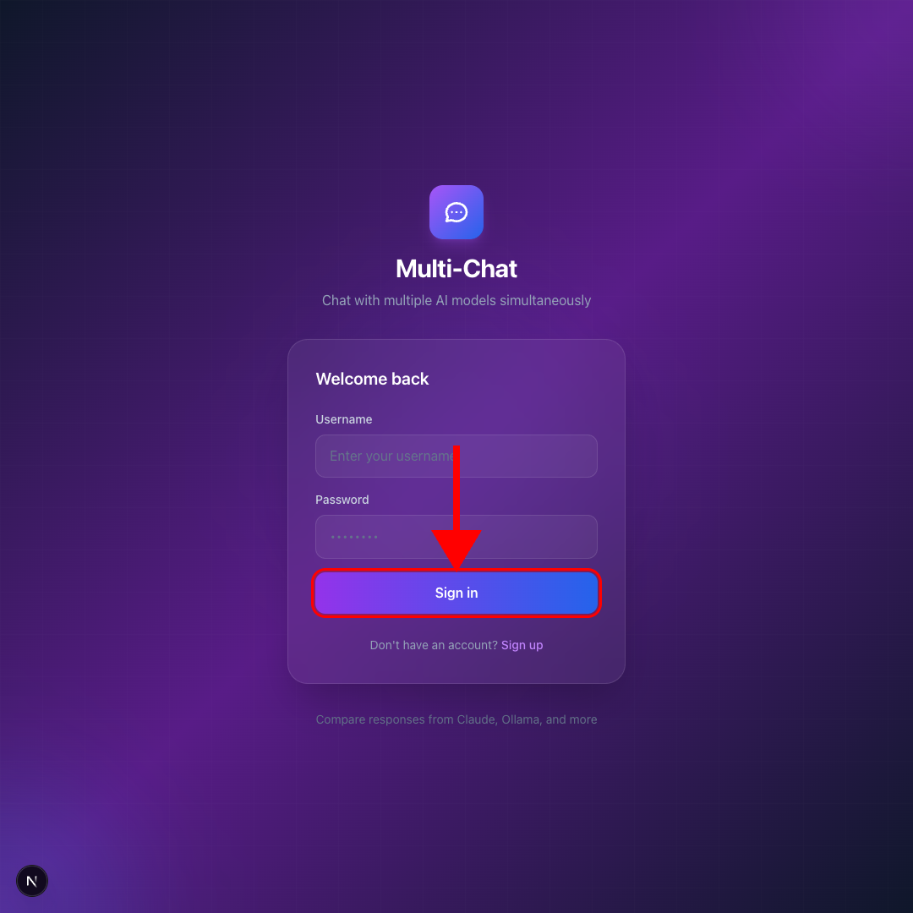
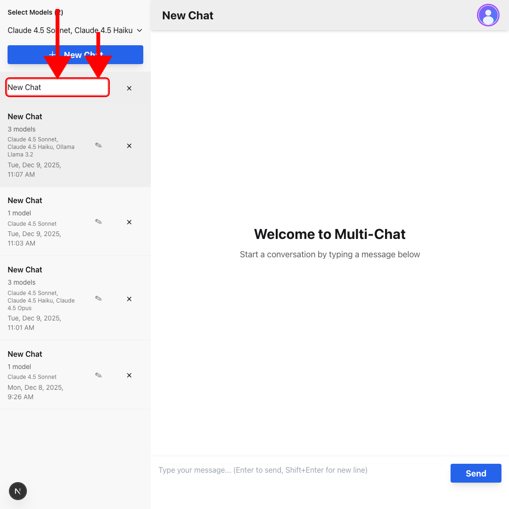
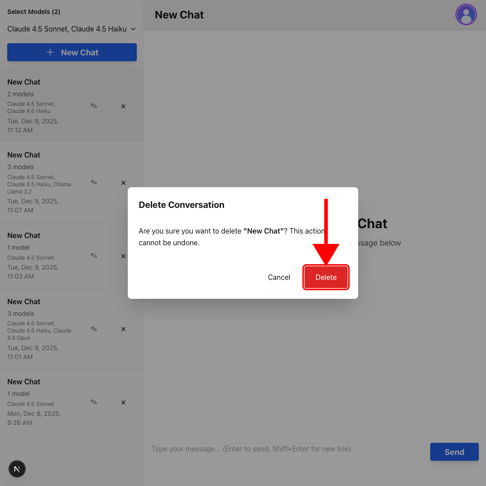
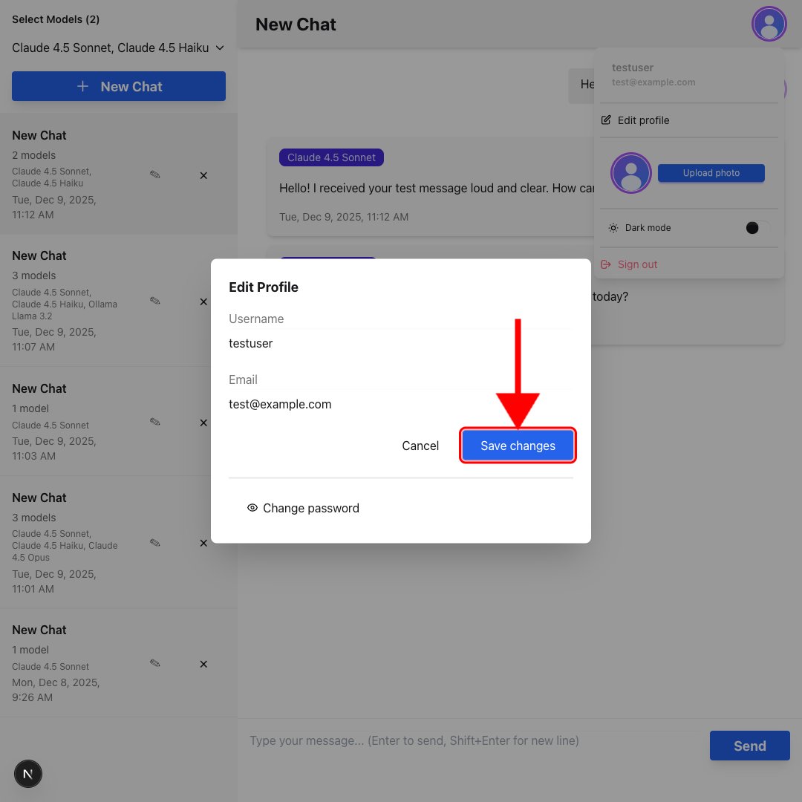
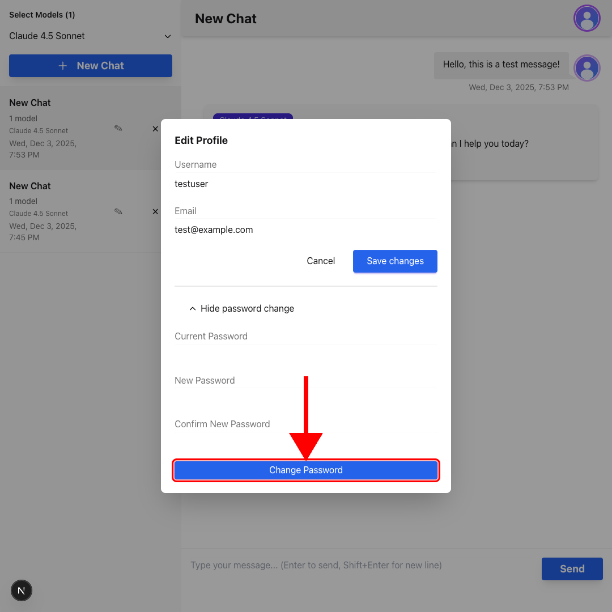
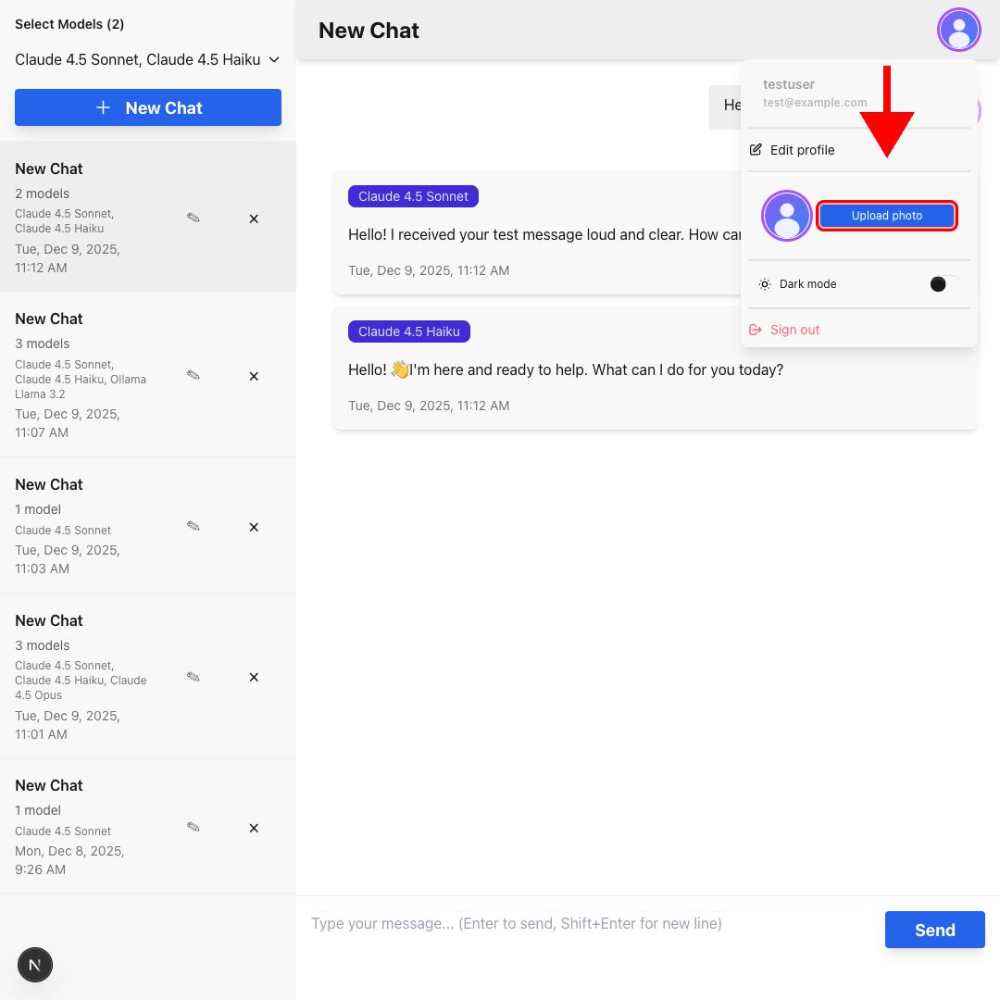
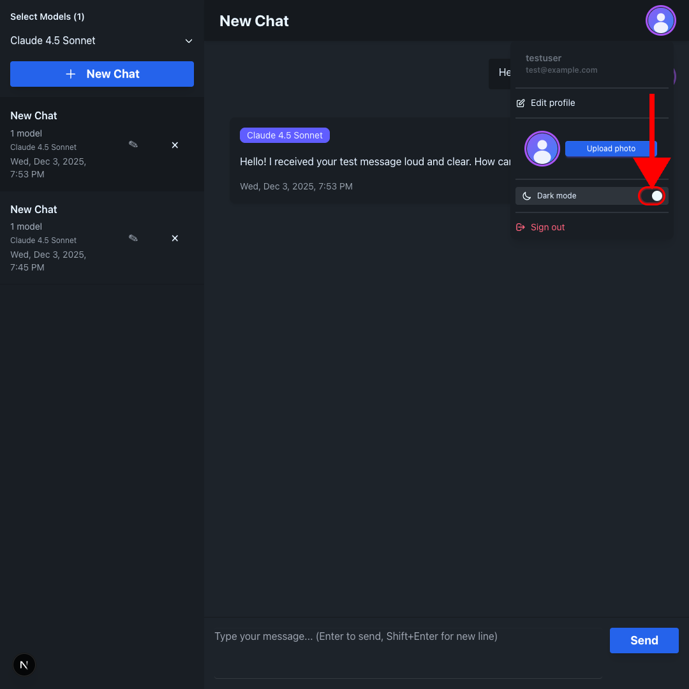
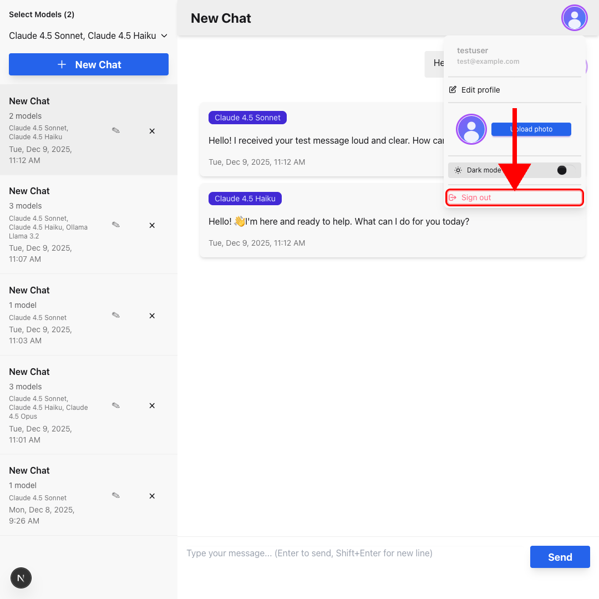

# Multi-Chat Demo - User Guide

Welcome to the Multi-Chat Demo user guide! This comprehensive help documentation will walk you through all the features of the application.

## Table of Contents

1. [Getting Started](#getting-started)
2. [Authentication](#authentication)
   - [Signing Up](#signing-up)
   - [Signing In](#signing-in)
3. [Conversations](#conversations)
   - [Creating a New Conversation](#creating-a-new-conversation)
   - [Selecting AI Models](#selecting-ai-models)
   - [Renaming Conversations](#renaming-conversations)
   - [Deleting Conversations](#deleting-conversations)
4. [Chatting](#chatting)
   - [Sending Messages](#sending-messages)
   - [Viewing Responses](#viewing-responses)
   - [Multi-Model Responses](#multi-model-responses)
5. [Profile Management](#profile-management)
   - [Editing Your Profile](#editing-your-profile)
   - [Changing Your Password](#changing-your-password)
   - [Uploading an Avatar](#uploading-an-avatar)
6. [Settings](#settings)
   - [Dark Mode](#dark-mode)
   - [Signing Out](#signing-out)
7. [Troubleshooting](#troubleshooting)

## Getting Started

Multi-Chat Demo is a web application that allows you to chat with multiple AI models simultaneously. You can compare responses from different AI models like Claude, Ollama, and more in real-time.

### Prerequisites

- A modern web browser (Chrome, Firefox, Safari, or Edge)
- An internet connection
- An account (you can create one for free)

 

_The welcome screen when you first visit the application_

## Authentication

### Signing Up

If you're new to Multi-Chat Demo, you'll need to create an account:

1. Navigate to the application in your web browser
2. You'll see the authentication page with a "Create account" option
3. Click on "Sign up" if you see the sign-in form
4. Fill in the following information:
   - **Username**: Choose a unique username
   - **Email**: Enter your email address
   - **Password**: Create a secure password (minimum 6 characters)
   - **Confirm Password**: Re-enter your password to confirm
5. Click "Create account"

 

_The sign-up form with all required fields_

**Tips:**

- Choose a username that's easy to remember
- Use a strong password with a mix of letters, numbers, and special characters
- Make sure both password fields match

### Signing In

To access your account:

1. Navigate to the application
2. Enter your username and password
3. Click "Sign in"

 

_The sign-in form_

If you don't have an account yet, click "Sign up" to create one.

## Conversations

### Creating a New Conversation

Conversations are where you chat with AI models. Each conversation can include multiple AI models.

1. In the left sidebar, you'll see a "Select Models" dropdown
2. Choose one or more AI models you want to chat with
3. Click the "New Chat" button
4. A new conversation will appear in your conversation list

 

_The conversation list sidebar with model selection_

**Note:** You must select at least one model before creating a new conversation.

### Selecting AI Models

You can select multiple AI models to compare their responses:

1. Click the "Select Models" dropdown in the sidebar
2. Check the boxes next to the models you want to use
3. You can select multiple models
4. The number of selected models is shown in the dropdown

 

_The model selection dropdown with multiple models selected_

Available models may include:

- Claude Sonnet 4.5
- Ollama models
- Other configured AI models

### Renaming Conversations

To rename a conversation:

1. Find the conversation in the left sidebar
2. Double-click on the conversation title
3. Type the new name
4. Press Enter or click outside the input field to save

Alternatively:

1. Click the edit (✎) button next to the conversation
2. Type the new name
3. Press Enter to save or Escape to cancel

 

_Editing a conversation title_

### Deleting Conversations

To delete a conversation:

1. Click the delete (×) button next to the conversation
2. A confirmation dialog will appear
3. Click "Delete" to confirm or "Cancel" to abort

 

_The delete confirmation dialog_

**Warning:** Deleting a conversation cannot be undone. All messages in that conversation will be permanently deleted.

## Chatting

### Sending Messages

Once you have a conversation open:

1. Type your message in the text area at the bottom of the screen
2. Click "Send" or press Enter to send the message
3. Press Shift+Enter to create a new line without sending

 

_The message input area_

**Tips:**

- You can send multi-line messages using Shift+Enter
- The send button is disabled while waiting for responses
- Messages are sent to all selected models in the conversation

### Viewing Responses

After sending a message:

1. Your message will appear on the right side with your avatar
2. Responses from each AI model will appear below your message
3. Each response is labeled with the model name
4. Responses appear as they are generated

 

_The chat window showing user message and AI responses_

### Multi-Model Responses

When you have multiple models selected:

1. Each model will generate its own response
2. Responses appear in separate cards below your message
3. Each card shows the model name as a badge
4. You can compare responses side-by-side

 

_Multiple AI model responses displayed together_

**Note:** While waiting for responses, you'll see loading indicators for each model that hasn't responded yet.

## Profile Management

### Accessing Your Profile

Click on your avatar in the top-right corner to open the profile menu.

 

_The profile dropdown menu_

### Editing Your Profile

To edit your username or email:

1. Click your avatar in the top-right corner
2. Click "Edit profile" from the dropdown menu
3. A modal will open with your profile information
4. Update your username and/or email
5. Click "Save changes"

 

_The edit profile modal_

### Changing Your Password

To change your password:

1. Open the "Edit profile" modal (see above)
2. Click "Change password" to expand the password section
3. Enter your current password
4. Enter your new password (minimum 6 characters)
5. Confirm your new password
6. Click "Change Password"

 

_The change password form_

**Important:** Make sure your new password and confirmation match.

### Uploading an Avatar

To upload or change your profile picture:

1. Click your avatar in the top-right corner
2. In the profile menu, find the avatar section
3. Click "Upload photo" (or "Change" if you already have one)
4. Select an image file from your computer
5. The image will be uploaded automatically

 

_The avatar upload section_

**Supported formats:** JPEG, PNG, GIF, WebP
**Maximum size:** 5MB

To remove your avatar:

1. Click your avatar in the top-right corner
2. Click "Remove" in the avatar section

## Settings

### Dark Mode

Toggle between light and dark themes:

1. Click your avatar in the top-right corner
2. Toggle the "Dark mode" switch in the profile menu
3. The theme will change immediately

 

_The dark mode toggle in the profile menu_

Your theme preference is saved and will persist across sessions.

### Signing Out

To sign out of your account:

1. Click your avatar in the top-right corner
2. Click "Sign out" at the bottom of the profile menu
3. You'll be redirected to the sign-in page

 

_The sign out option in the profile menu_

## Troubleshooting

### Common Issues

**I can't sign in**

- Verify your username and password are correct
- Make sure you've created an account first
- Check your internet connection

**Messages aren't sending**

- Ensure you have at least one model selected in the conversation
- Check your internet connection
- Try refreshing the page

**Responses are slow**

- AI model responses depend on the model's processing time
- Multiple models may take longer to respond
- Check your internet connection

**Avatar won't upload**

- Ensure the file is in a supported format (JPEG, PNG, GIF, WebP)
- Check that the file size is under 5MB
- Try a different image file

**Conversation won't delete**

- Make sure you're clicking the delete button (×) next to the conversation
- Confirm the deletion in the dialog that appears
- Refresh the page if the issue persists

### Getting Help

If you continue to experience issues:

1. Check that both the backend and frontend servers are running
2. Check your browser's console for error messages
3. Verify your API keys are configured correctly (for administrators)
4. Review the setup documentation in [README_SETUP.md](../../README_SETUP.md)

## Keyboard Shortcuts

- **Enter**: Send message
- **Shift+Enter**: New line in message
- **Escape**: Cancel editing conversation title
- **Enter** (while editing title): Save conversation title

## Best Practices

1. **Organize conversations**: Use descriptive names for your conversations to easily find them later
2. **Compare models**: Select multiple models to compare their responses and find the best one for your needs
3. **Keep messages clear**: Write clear, specific questions to get better responses
4. **Manage storage**: Delete old conversations you no longer need
5. **Secure your account**: Use a strong password and keep it private

---

**Need more help?** Check out the [Setup Guide](../../README_SETUP.md) or [Testing Documentation](../../TESTING.md) for technical details.
